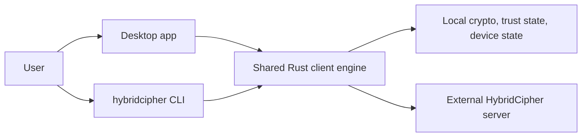

# HybridCipher Public Source

HybridCipher is a secure file-sharing system for teams that want client-side
encryption, explicit device trust, and a post-quantum migration path. This
repository contains the public client-side source for the desktop app, the
bundled `hybridcipher` CLI, and the shared Rust crates they use.

If you are new to the repository, start with this mental model:

- the desktop app and CLI are two entry points into the same client engine
- encryption, decryption, local secret handling, and trust checks happen on the
  client side
- the server is an external coordination system from this repo's point of view

## How It Fits Together



At a high level:

1. A user interacts through the desktop app or the bundled CLI.
2. The shared client engine performs encryption, decryption, trust validation,
   and local state handling on the user device.
3. Only ciphertext, metadata, and encrypted coordination artifacts are sent to
   the external server.

For the deeper repo-level explanation, start with
[apps/desktop/architecture/README.md](apps/desktop/architecture/README.md).

## What This Repo Contains

Included here:

- `apps/desktop/` for the Tauri desktop app, frontend assets, legal notices,
  release metadata, icons, and the optional feedback API helper
- the Rust crates needed to build the desktop app and bundled CLI from source
- public rebuild tooling such as `scripts/macos/public_desktop_verify.sh`
- [docs/desktop/OPEN_SOURCE_VERIFY.md](docs/desktop/OPEN_SOURCE_VERIFY.md) for
  the public verification model and hash-comparison rules
- [LICENSE](LICENSE) for the repository-level licensing terms
- [CONTRIBUTING.md](CONTRIBUTING.md) for contribution guidance

Not included here:

- the server-side and transparency-publishing components
- deployment and operations directories such as `config/`, `ops/`, `docker/`,
  and `k8s/`
- private planning notes and internal operational documentation

## Build Locally From Source

### General workspace checks

From the repository root:

```bash
cargo build
cargo test
```

### macOS prerequisites for desktop builds

The public desktop build flow is currently macOS-focused and expects:

- Xcode command line tools
- Rust stable plus the macOS target you want to build
- Node.js 18+ with `npm`
- `python3`

Example target setup:

```bash
rustup target add aarch64-apple-darwin
rustup target add x86_64-apple-darwin
```

### Reproducible unsigned macOS desktop build

If you want the supported public rebuild path, use the verification script:

```bash
MODE=silicon ./scripts/macos/public_desktop_verify.sh
MODE=full ./scripts/macos/public_desktop_verify.sh
```

Published verification values for the current source snapshot:

<!-- BEGIN GENERATED VERIFY HASHES -->
| Source ref | Target | Artifact | SHA-256 |
| --- | --- | --- | --- |
| `f84ec33f0ae697f13331ff235185d88ed8a41848` | `aarch64-apple-darwin` | `HybridCipher_aarch64.unsigned.app.tar.gz` | `76ece4198928b56323bd6ad7989a4e9c8e553da2027d08eb7321bc982aff7674` |
| `f84ec33f0ae697f13331ff235185d88ed8a41848` | `x86_64-apple-darwin` | `HybridCipher_x86_64.unsigned.app.tar.gz` | `2e955aac18e7a16f1a03e6ff9dd1371d76675ebd7410df4203a94f0cd5783dc2` |
<!-- END GENERATED VERIFY HASHES -->

That script:

- installs the desktop frontend dependencies
- builds the `hybridcipher` CLI for each requested target
- stages that CLI into `apps/desktop/src-tauri/resources/bin/`
- builds the unsigned desktop bundle
- writes deterministic `.tar.gz` and `.sha256` outputs for comparison

Read [docs/desktop/OPEN_SOURCE_VERIFY.md](docs/desktop/OPEN_SOURCE_VERIFY.md)
for what that build proves and which hashes to compare.

### Manual desktop build workflow

If you want to build the desktop app step by step instead of using the helper
script, use the same sequence the public build tooling expects:

```bash
cargo build --release --bin hybridcipher --target aarch64-apple-darwin
install -d apps/desktop/src-tauri/resources/bin
install -m 0755 \
  target/aarch64-apple-darwin/release/hybridcipher \
  apps/desktop/src-tauri/resources/bin/hybridcipher
cd apps/desktop
npm install
npx tauri build --target aarch64-apple-darwin
```

That manual flow stages the CLI into the app resources before packaging, which
matches the way `scripts/macos/public_desktop_verify.sh` prepares the bundle.

### Local desktop development

For local desktop development without packaging, point the app at a
workspace-built CLI explicitly:

```bash
cargo build --release --bin hybridcipher
export HYBRIDCIPHER_CLI_PATH="$PWD/target/release/hybridcipher"
cd apps/desktop
npm install
npx tauri dev
```

The app can also discover some workspace-built CLI outputs automatically, but
setting `HYBRIDCIPHER_CLI_PATH` keeps the local development path explicit.

## Verify a Published Release

Use the public verification flow when you want to reproduce the canonical
unsigned macOS app archive for a release snapshot and compare its SHA-256 hash:

```bash
MODE=silicon ./scripts/macos/public_desktop_verify.sh
```

The verification model, artifact names, and hash-comparison guidance live in
[docs/desktop/OPEN_SOURCE_VERIFY.md](docs/desktop/OPEN_SOURCE_VERIFY.md).

## Start Here

- Want to understand the public architecture:
  [apps/desktop/architecture/README.md](apps/desktop/architecture/README.md)
- Want the desktop app overview:
  [apps/desktop/README.md](apps/desktop/README.md)
- Want to build the desktop app from source:
  this [README.md](README.md)
- Want to verify a published release:
  [docs/desktop/OPEN_SOURCE_VERIFY.md](docs/desktop/OPEN_SOURCE_VERIFY.md)
- Want to contribute:
  [CONTRIBUTING.md](CONTRIBUTING.md)

## Contributing

If you want to help improve the public client surface, start with
[CONTRIBUTING.md](CONTRIBUTING.md). That guide points to the desktop, CLI, and
shared client layers that are present in this repository.
