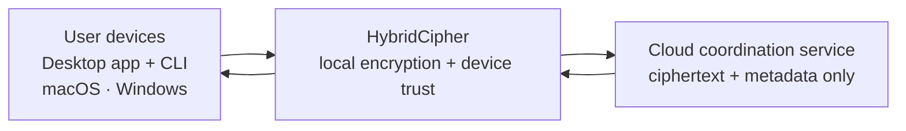
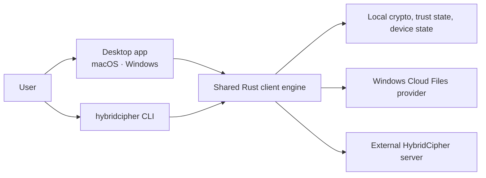

# HybridCipher

HybridCipher protects shared files before they leave the device.

It is built for teams that need client-side encryption, explicit device trust,
and a post-quantum migration path without asking the cloud service to handle
plaintext files. The desktop app and bundled `hybridcipher` CLI give users two
entry points into the same local client engine: files are encrypted, decrypted,
checked, and trusted on the user's device before encrypted coordination data is
sent to the cloud.

HybridCipher runs on macOS and Windows. On Windows the desktop app integrates
with Windows Cloud Files so that encrypted vaults appear as native Explorer
folders with on-demand hydration.

## Platform app versions

Edit the app version only in `apps/desktop/src-tauri/tauri.windows.conf.json`
for Windows or `apps/desktop/src-tauri/tauri.macos.conf.json` for macOS.
Their release versions advance independently. Build scripts, public verifiers,
installer metadata, and the running app use the corresponding platform config.

The shared desktop `Cargo.toml` and `Cargo.lock` contain crate metadata, not
the Windows or macOS app release version. Builds do not synchronize these
versions or rewrite the shared `tauri.conf.json`. Missing or invalid platform
versions stop the build. `VERSION_OVERRIDE` may only forward the same macOS
version; conflicting overrides are rejected. Store and sparse MSIX identity
revisions remain separate from the Windows app version.

## Why HybridCipher Exists

Most file-sharing systems make the cloud service part of the trust boundary.
HybridCipher is designed for a stricter model: user devices do the sensitive
cryptographic work locally, while the cloud service coordinates encrypted
collaboration, metadata, device state, and recovery workflows.

That separation helps teams reduce the impact of server compromise, stolen
devices, and long-term cryptographic migration pressure.

## Who It Is For

HybridCipher is for teams and builders who need stronger guarantees than
ordinary cloud sync:

- organizations sharing sensitive files across trusted devices
- security-conscious teams that want client-side encryption by default
- operators who need visible device trust, recovery, and coverage workflows
- developers and auditors who want to inspect the public client implementation

## What It Protects Against

HybridCipher is designed to keep plaintext and local secrets on trusted user
devices. The cloud coordination service should receive ciphertext, metadata,
and encrypted coordination artifacts, not raw file contents or plaintext epoch
keys.


```mermaid
flowchart LR
    Device["User devices<br/>Desktop app + CLI<br/>macOS · Windows"]
    HC["HybridCipher<br/>local encryption + device trust"]
    Cloud["Cloud coordination service<br/>ciphertext + metadata only"]

    Device --> HC
    HC --> Cloud
    Cloud --> HC
    HC --> Device
```

## How the Public Source Fits Together

This repository contains the public client-side source for the desktop app, the
bundled `hybridcipher` CLI, the Windows Cloud Files provider, and the shared
Rust crates used by HybridCipher client builds. The server is an external
coordination system from this repo's point of view.


```mermaid
flowchart LR
    User["User"] --> Desktop["Desktop app<br/>macOS · Windows"]
    User --> CLI["hybridcipher CLI"]
    Desktop --> Client["Shared Rust client engine"]
    CLI --> Client
    Client --> Local["Local crypto, trust state, device state"]
    Client --> CloudFiles["Windows Cloud Files provider"]
    Client --> Server["External HybridCipher server"]
```

At a high level:

1. A user interacts through the desktop app or the bundled CLI.
2. The shared client engine performs encryption, decryption, trust validation,
   and local state handling on the user device.
3. On Windows, the Cloud Files provider exposes encrypted vaults as native
   Explorer folders with on-demand hydration.
4. Only ciphertext, metadata, and encrypted coordination artifacts are sent to
   the external server.

For the deeper repo-level explanation, start with
[apps/desktop/architecture/README.md](apps/desktop/architecture/README.md).

## Edition Model

The public source is the shared client implementation used by both personal and
team-capable HybridCipher builds. Some distributed desktop packages may enable a
restricted personal build profile that disables team and group administration
commands, but that restriction is a packaging choice layered on top of the same
client engine.

| Capability | Personal build | Team-capable build |
| --- | --- | --- |
| Shared crypto and client engine | Included | Included |
| Desktop app and `hybridcipher` CLI core | Included | Included |
| Windows Cloud Files provider | Included | Included |
| Personal protected-folder workflows | Included | Included |
| Team and group administration | Disabled in restricted builds | Included |
| Server, deployment, and operations code | Not included in this public repo | Not included in this public repo |

## What This Repo Contains

Included here:

- `apps/desktop/` for the Tauri desktop app, frontend assets, legal notices,
  release metadata and icons
- the Rust crates needed to build the desktop app and bundled CLI from source,
  including the Windows Cloud Files provider
- macOS public rebuild tooling: `scripts/macos/public_desktop_verify.sh`
- shared macOS build and File Provider validation tooling:
  `scripts/macos/desktop_release_pkg.sh`, also used by the macOS release workflow
- platform version readers: `scripts/macos/app_version.sh` and
  `scripts/winos/app-version.ps1`
- Windows public rebuild tooling: `scripts/winos/public_desktop_verify.ps1`
- [docs/desktop/OPEN_SOURCE_VERIFY.md](docs/desktop/OPEN_SOURCE_VERIFY.md) for
  the public verification model and hash-comparison rules
- [LICENSE](LICENSE) for the repository-level licensing terms
- [CONTRIBUTING.md](CONTRIBUTING.md) for contribution guidance

Not included here:

- the server-side and transparency-publishing components
- deployment and operations directories such as `config/`, `ops/`, `docker/`,
  and `k8s/`
- private planning notes and internal operational documentation

## Build Locally From Source

### General workspace checks

From the repository root:

```bash
cargo build
cargo test
```

### macOS prerequisites

- Xcode command line tools
- Rust stable plus the macOS target you want to build
- Node.js 18+ with `npm`
- `python3`

Example target setup:

```bash
rustup target add aarch64-apple-darwin
rustup target add x86_64-apple-darwin
```

### Windows prerequisites

- Visual Studio Build Tools with the "Desktop development with C++" workload
- Windows 10 or Windows 11 SDK
- Rust stable MSVC toolchain (`x86_64-pc-windows-msvc` target)
- Node.js 20+ with `npm`

Example target setup:

```powershell
rustup target add x86_64-pc-windows-msvc
```

### Reproducible unsigned macOS desktop build

Use the verification script to produce canonical unsigned macOS app archives:

```bash
MODE=silicon ./scripts/macos/public_desktop_verify.sh
MODE=full ./scripts/macos/public_desktop_verify.sh
```

Published macOS verification values for the current source snapshot:

<!-- BEGIN GENERATED VERIFY HASHES -->
| Source ref | Target | Artifact | SHA-256 |
| --- | --- | --- | --- |
| `13822a6122ffc3d61a718e08ae7c6e337b008fcd` | `aarch64-apple-darwin` | `HybridCipher_aarch64.unsigned.app.tar.gz` | `4d8e38f901aeb9e4cd9e261b3db031eac69e4bc7ff0642112bf9b5dfeefb82c8` |
| `13822a6122ffc3d61a718e08ae7c6e337b008fcd` | `x86_64-apple-darwin` | `HybridCipher_x86_64.unsigned.app.tar.gz` | `fc3ce38927bda05df72dd46fca2426a8d89af7c884dfa15b0231f5c454d10e8a` |
<!-- END GENERATED VERIFY HASHES -->

That script:

- installs the desktop frontend dependencies
- builds the `hybridcipher` CLI for each requested target
- stages that CLI into `apps/desktop/src-tauri/resources/bin/`
- builds the unsigned desktop bundle
- writes deterministic `.tar.gz` and `.sha256` outputs for comparison

### Reproducible unsigned Windows desktop build

Use the verification script to produce the canonical unsigned Windows NSIS
installer:

```powershell
powershell -ExecutionPolicy Bypass -File .\scripts\winos\public_desktop_verify.ps1
```

The script prepares the MSVC environment, builds the bundled CLI, installs the
locked desktop dependencies, and packages the Tauri desktop app as an unsigned
NSIS installer. It writes a `.sha256` file beside the generated installer for
comparison.

The outputs are written to:

- `target\x86_64-pc-windows-msvc\release\bundle\nsis\HybridCipher_<version>_x64-setup.exe`
- `target\x86_64-pc-windows-msvc\release\bundle\nsis\HybridCipher_<version>_x64-setup.exe.sha256`

Published Windows verification values for the current source snapshot:

<!-- BEGIN GENERATED WINDOWS VERIFY HASHES -->
| Source ref | Target | Artifact | SHA-256 |
| --- | --- | --- | --- |
| `b2d1ca7ba9d1181e24bac1b6a5f86aaaeede8577` | `x86_64-pc-windows-msvc` | `HybridCipher_0.1.1_x64-setup.exe` | `2fe3ed240251b89cc95e4bc9dcf52cccc3692a78eb262e76ebccfcb815c91eac` |
<!-- END GENERATED WINDOWS VERIFY HASHES -->

Read [docs/desktop/OPEN_SOURCE_VERIFY.md](docs/desktop/OPEN_SOURCE_VERIFY.md)
for what that build proves and which hashes to compare.

### Manual macOS desktop build

If you want to build the desktop app step by step instead of using the helper
script, use the same sequence the public build tooling expects:

```bash
cargo build --release --bin hybridcipher --target aarch64-apple-darwin
install -d apps/desktop/src-tauri/resources/bin
install -m 0755 \
  target/aarch64-apple-darwin/release/hybridcipher \
  apps/desktop/src-tauri/resources/bin/hybridcipher
cd apps/desktop
npm install
npx tauri build --target aarch64-apple-darwin
```

That manual flow builds the Tauri app and stages its CLI resource. Use
`scripts/macos/public_desktop_verify.sh` to also build and stage the native File
Provider runtime, validate the assembled bundle, and produce canonical archives
and hashes. The verifier shares those routines with `desktop_release_pkg.sh`.

### Manual Windows desktop build

```powershell
rustup target add x86_64-pc-windows-msvc
cargo build --release --target x86_64-pc-windows-msvc -p hybridcipher-cli --bin hybridcipher
$env:HYBRIDCIPHER_CLI_PATH = (Resolve-Path "target\x86_64-pc-windows-msvc\release\hybridcipher.exe").Path
cd apps\desktop
npm ci
npx tauri build --target x86_64-pc-windows-msvc --bundles nsis --no-sign
```

### Local desktop development

For local desktop development without packaging, point the app at a
workspace-built CLI explicitly:

```bash
cargo build --release --bin hybridcipher
export HYBRIDCIPHER_CLI_PATH="$PWD/target/release/hybridcipher"
cd apps/desktop
npm install
npx tauri dev
```

On Windows:

```powershell
cargo build --release --bin hybridcipher
$env:HYBRIDCIPHER_CLI_PATH = (Resolve-Path "target\release\hybridcipher.exe").Path
cd apps\desktop
npm install
npx tauri dev
```

The app can also discover some workspace-built CLI outputs automatically, but
setting `HYBRIDCIPHER_CLI_PATH` makes the local development path explicit.

## Verify a Published Release

### macOS

Use the public verification flow to reproduce the canonical unsigned macOS app
archive for a release snapshot and compare its SHA-256 hash:

```bash
MODE=silicon ./scripts/macos/public_desktop_verify.sh
```

### Windows

Use the public verification flow to reproduce the canonical unsigned NSIS
installer and compare its SHA-256 hash:

```powershell
powershell -ExecutionPolicy Bypass -File .\scripts\winos\public_desktop_verify.ps1
```

The verification model, artifact names, and hash-comparison guidance live in
[docs/desktop/OPEN_SOURCE_VERIFY.md](docs/desktop/OPEN_SOURCE_VERIFY.md).

## Start Here

- Want to understand the public architecture:
  [apps/desktop/architecture/README.md](apps/desktop/architecture/README.md)
- Want the desktop app overview:
  [apps/desktop/README.md](apps/desktop/README.md)
- Want to build the desktop app from source:
  this [README.md](README.md)
- Want to verify a published release:
  [docs/desktop/OPEN_SOURCE_VERIFY.md](docs/desktop/OPEN_SOURCE_VERIFY.md)
- Want to contribute:
  [CONTRIBUTING.md](CONTRIBUTING.md)

## Contributing

If you want to help improve the public client surface, start with
[CONTRIBUTING.md](CONTRIBUTING.md). That guide points to the desktop, CLI, and
shared client layers that are present in this repository.

## Public export safeguards

The public desktop export excludes the feedback API and the shared source catalog
`apps/desktop/release-notes/releases.json`. Windows and macOS keep their own
release-note catalogs; signed bundles may still name the selected catalog
`release-notes/releases.json` inside the installed application.

Both exporters exclude credential files, environment files, logs, and generated
directories at any depth. They validate a temporary export before replacing the
destination. Recognizable credentials or symlinks stop the export; diagnostics
show file paths, line numbers, and rule names without printing secret values.
