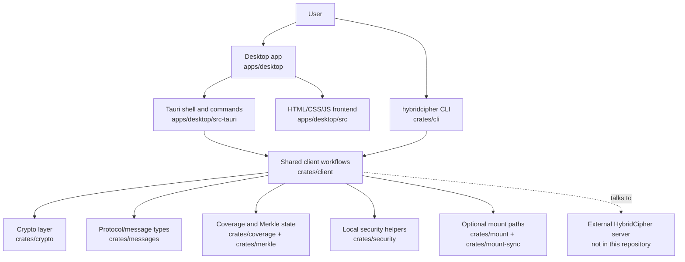
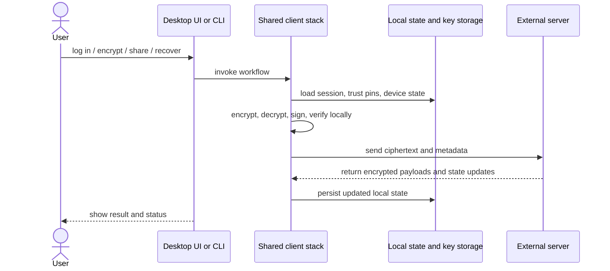
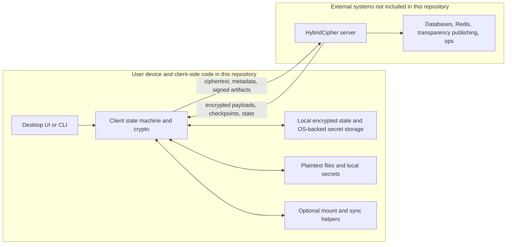

# How HybridCipher Public Source Fits Together

This document explains the client-side HybridCipher code published in this
repository. It focuses on the desktop app, the bundled `hybridcipher` CLI, and
the shared Rust crates those entry points use.

It does not try to describe the full HybridCipher deployment. The server,
transparency publisher, production config, and operations tooling are outside
this repository, so this explainer treats them as external systems.

## Repository Scope

Included here:

- `apps/desktop/`: desktop frontend, Tauri shell, legal docs, release metadata,
  icon assets, and the optional feedback API helper
- `crates/cli/`: the user-facing `hybridcipher` command-line interface
- `crates/client/`: shared client workflow and state logic reused by desktop,
  CLI, and optional mount flows
- `crates/crypto/`: local cryptographic operations, including HybridCipher's
  hybrid X25519 + ML-KEM-768 flow implemented with AWS-LC-backed ML-KEM support
- `crates/messages/`, `crates/coverage/`, `crates/merkle/`, and
  `crates/security/`: protocol types, coverage bookkeeping, Merkle structures,
  and local security helpers
- `crates/mount/` and `crates/mount-sync/`: optional local filesystem and mirror
  integrations that sit on top of the same client stack

Not included here:

- `crates/server/`
- `crates/transparency_publisher/`
- deployment/config/ops directories such as `config/`, `ops/`, `docker/`, and
  `k8s/`

## One-Sentence Mental Model

HybridCipher's public repo is a client-side stack: desktop UI and CLI entry
points call into the same Rust client engine, which performs encryption,
device-state handling, trust checks, and coverage logic locally before talking
to an external HybridCipher server.

## Public Component Map

## What Each Layer Is Doing

| Layer | What it does | Main paths |
|---|---|---|
| Desktop UI | Presents the app, settings, flows, release notes, and user actions | `apps/desktop/src/` |
| Tauri shell | Bridges the web UI to native Rust commands, packaging, updater, and local integrations | `apps/desktop/src-tauri/` |
| CLI | Exposes the same system through commands for auth, trust, encryption, coverage, and recovery flows | `crates/cli/` |
| Shared client | Holds the core local workflows: sessions, local state, trust material, epoch handling, and file operations | `crates/client/` |
| Crypto | Performs local encryption, signing, key derivation, and hybrid key-delivery logic | `crates/crypto/` |
| Coverage/Merkle | Tracks file-to-epoch coverage state and proof-oriented integrity structures | `crates/coverage/`, `crates/merkle/` |
| Mount integrations | Offer optional mounted or mirrored local-folder flows on top of the same client engine | `crates/mount/`, `crates/mount-sync/` |

## Typical Public-Surface Flow

The public code in this repository follows this shape:

1. A user starts from the desktop UI or the CLI.
2. The UI/Tauri shell or CLI command invokes the shared client stack.
3. The client stack loads local state such as sessions, pinned trust material,
   device data, and cached epoch metadata.
4. Encryption, decryption, signing, and key handling happen locally in the
   client and crypto layers.
5. The client sends ciphertext, metadata, encrypted Welcome payloads, or trust
   and coverage artifacts to an external server API.
6. The client persists updated local state and returns results to the UI or CLI.

## Trust Boundary for Public Readers

The most important thing to understand is where plaintext and secrets live in
the published code surface.

In plain terms:

- plaintext handling happens on the client side
- this repository mainly shows the client implementation
- the server is an external dependency from the repo's point of view
- the desktop app and CLI are two interfaces over the same core client logic

## Where New Contributors Should Start

If you want to understand the published source quickly, read it in this order:

1. `apps/desktop/README.md`
2. `apps/desktop/src-tauri/src/commands.rs`
3. `crates/cli/src/`
4. `crates/client/src/`
5. `crates/crypto/src/`
6. `crates/coverage/src/` and `crates/merkle/src/`

That path takes you from user-facing entry points down into the shared client
and crypto layers without requiring the server implementation that is not part
of this repository.
